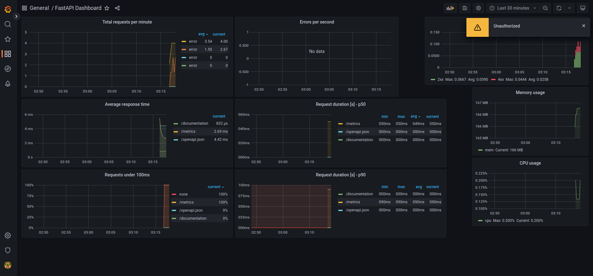

# PodFoods ML Backend Demo

## Table of Content
  * [Setting up](#setting-up)
    + [Prerequisites](#prerequisites)
    + [Installation](#installation)
  * [Usage](#usage)
    + [System architecture](#system-architecture)
    + [API documentation](#api-documentation)
    + [Model training](#model-training)
    + [ETL](#etl)
    + [Monitoring](#monitoring)
    + [Testing](#testing)
  * [Termination](#termination)
  * [References](#references)
  * [Task list](#task-list)

## Setting up

### Prerequisites

You will need:

1. python (3.8): install with [miniconda](https://docs.conda.io/en/main/miniconda.html) or [the official release](https://www.python.org/downloads/release/python-380/)
2. [docker](https://docs.docker.com/engine/install/) and [docker-compose](https://docs.docker.com/compose/install/)
3. __Operating System__: I'm using Ubuntu 22.04 LTS to build and test these services, but they should also work on Windows and MacOS, however some of the instructions below might need modification, particularly for Windows (e.g. bash scripts).

### Installation

1. Clone this repository:
```
git clone git@github.com:truonghm/pf-backend.git
cd pf-backend
```

2. Create a new Python environment for isolation. If you use `conda`, you can run:

```
conda create --name pf python=3.8
conda activate pf
```

3. Next, install the neccessary packages:
```
pip install -r requirements.txt
```

4. Create the environment variable file: Simply rename the `.env.example` file to `.env`. 
```bash
cp .env.example .env
```


## Usage


1. To start the main serivces (FastAPI, Grafana, Prometheus, MLflow, MySQL DB), run:

```bash
# add -d flag to run in detach mode
docker-compose --file docker-compose.yaml up
```

__Alternatively__, use `docker-compose-airflow.yaml` to include Airflow in the serivces.
Note that I don't include Airflow in the main `docker-compose.yaml` file ([reason below](#etl)), however I still build it for the sake of completeness.
```bash
# if you are using a Linux distro, run prepare_airflow.sh first. If not, skip this step
./prepare_airflow.sh

# add -d flag to run in detach mode
docker-compose --file docker-compose-airflow.yaml up
```

2. Copy the raw data (3 csv files, `data_metadata_product.csv`, `data_metadata_store.csv`, `data_order.csv` into the [`training/data`](training/data) folder). I do not upload these files to Github as they are (supposely) confidential.


3. To prepare data and train model, run:

```bash
cd training
python preprocess.py && python train.py
```
Note that the model is not available in this repository (git-ignored), so you have to go through the step above for it to be available in the API service.

4. Access the services with:
    - API docs: [localhost:8000/documentation](http://localhost:8000/documentation)
    - MLFlow: [localhost:5000](http://localhost:5000)
    - Prometheus: [localhost:9090](http://localhost:9090). Also visit [localhost:8000/metrics](http://127.0.0.1:8000/metrics) to see which metrics are being tracked.
    - Grafana: [localhost:3000](http://localhost:3000) with username==`admin` and password==`pass@123`
    - Airflow Webserver: [localhost:8080](http://localhost:8080) with username==`airflow` and password==`airflow`

5. Play around and explore! For more details on each part of the demo, please go to the corresponding sections below: 

  + [System architecture](#system-architecture)
  + [API documentation](#api-documentation)
  + [Model training](#model-training)
  + [ETL](#etl)
  + [Monitoring](#monitoring)
  + [Testing](#testing)


### System architecture

The backend system looks something like this:


### API documentation

#### Endpoint URL

> http://127.0.0.1:8000/quantity/predict

#### API information

| API info        | Detail |
| --------------- | ------ |
| Method          | POST   |
| Response format | JSON   |
| Authentication  | No     |


#### Body Parameters

| Parameter           | Detail                          | Type    | Required? |
| ------------------- | ------------------------------- | ------- | --------- |
| input               | List of store and product pairs | list    | Yes       |
| input[0].store_id   | ID of store                     | integer | Yes       |
| input[0].product_id | ID of product                   | integer | Yes       |
| date                | Check out date                  | string  | No        |

#### Example Requests

```bash
curl -X 'POST' \
  'http://127.0.0.1:8000/quantity/predict' \
  -H 'accept: application/json' \
  -H 'Content-Type: application/json' \
  -d '{
  "input": [
    {
      "store_id": 55,
      "product_id": 1866
    },
    {
      "store_id": 55,
      "product_id": 1867
    },
    {
      "store_id": 55,
      "product_id": 1939
    }
  ],
  "date": "string"
}'
```

#### Example Response

```
{
  "predictions": [
    2,
    3
  ]
}

```


### Model training

Folder structure:

```
training
├── artifacts
├── data
│   ├── data_metadata_product.csv
│   ├── data_metadata_store.csv
│   ├── data_order.csv
│   ├── ...
├── dev
│   ├── model.ipynb
├── preprocess.py
├── train.py
```
To transform data and save it to database:
```bash
python preprocess.py
```

To train the model:
```bash
python train.py
```

There is also the Jupyter Notebook with more details on model development at [`training/dev/model.ipynb`](training/dev/model.ipynb).

#### Model registry

MLFlow UI: [localhost:5000](http://localhost:5000).

MLFLow is used for experiment tracking and as a model store. It is supported by a MySQL db and saves model to a local directory ([`training/artifacts`](training/artifacts)). In real MLops system this could be a cloud storage (S3 or GCS).


### ETL

I don't include Airflow in the main backend services due to:
- Size of the Airflow docker images
- Complexity
- I want to focus more on the ML size of things while Airflow is for orchestration.

As such, please use `docker-compose-airflow.yaml` if you also want to include Airflow in the serivces.
Note that for Linux distributions, the `AIRFLOW_UID` environment variable need to be specified with the correct value in order for Airflow to have the correct permissions. 

```bash
# if you are using a Linux distro, run prepare_airflow.sh first. If not, skip this step
./prepare_airflow.sh

# add -d flag to run in detach mode
docker-compose --file docker-compose-airflow.yaml up
```

The is one task available in Airflow: `dag_quantity_model_preprocessing`. The transformation is done in Python (pandas).

Data are stored on a MySQL database (`mysql:3306`) with the following tables:
- `fact_order_items`, corresponds with the `data_order.csv` file
- `dim_product`, corresponds with the `data_metadata_product.csv` file
- `dim_store`, corresponds with the `data_metadata_store.csv` file
- `features`, features after transformation

### Monitoring

- Prometheus: [localhost:9090](http://localhost:9090)
- Grafana: [localhost:3000](http://localhost:3000) with username==`admin` and password==`pass@123`

Note that due to limited time, I only use the stock dashboard (from [here](https://github.com/Kludex/fastapi-prometheus-grafana)) in Grafana with some setting modification. Given more time, a better dashboard that show tailor-made metrics for the model can be built.

The dashboard has already been loaded into Grafana after running Docker Compose. Please go to __Dashboard > Browse > FastAPI Dashboard__ to view the dashboard.



### Testing

Due to the limited time allowed for this demo, I don't have time to set up testing for the backend services.

## Termination

To shutdown the containers and remove all volumes:

```bash
docker-compose down -v
```

To remove unused images

```bash
docker image prune -a
```

## References

1. [Provisioning Grafana](https://grafana.com/docs/grafana/latest/administration/provisioning/#dashboards)
2. [FastAPI + Prometheus + Grafana](https://github.com/Kludex/fastapi-prometheus-grafana)
3. [MLflow Tracking](https://www.mlflow.org/docs/latest/tracking.html)
4. [Running Airflow in Docker](https://airflow.apache.org/docs/apache-airflow/stable/howto/docker-compose/index.html)


## Task list

- [x] Build skeleton (FastAPI + Grafana + Prometheus)  
- [x] Containerize  
- [x] Add MLflow  
- [x] Add MySQL  
- [X] Add Airflow  
- [ ] Add quality-of-life features:    
    - [X] Automatically add datasource and dashboard for Grafana at build  
    - [ ] Feature store (Feast) -> Not available due to limited time
    - [ ] Testing -> Not available due to limited time
- [X] Write documentation  
    - [X] Set-up and how-to-use  
    - [X] Doc for API endpoint  
    - [X] System architecture  