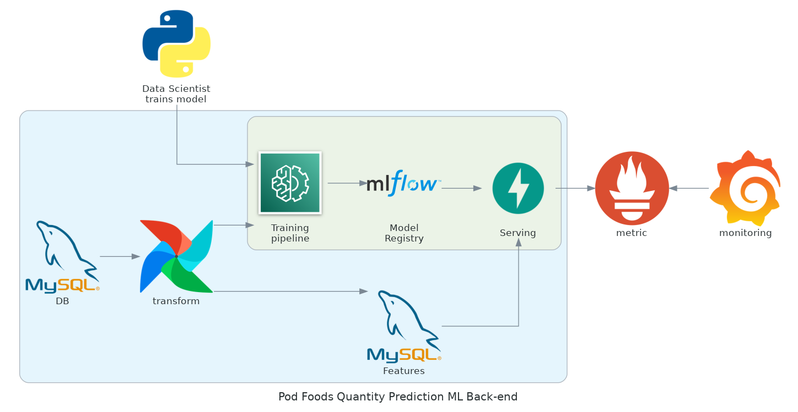

# Back-end Demo for Quantity Prediction Model (Pod Foods)


## Setting up

### Prerequisites

You will need:

1. python (3.8): install with [miniconda](https://docs.conda.io/en/main/miniconda.html) or [the official release](https://www.python.org/downloads/release/python-380/)
2. [docker](https://docs.docker.com/engine/install/) and [docker-compose](https://docs.docker.com/compose/install/)
3. __Operating System__: I'm using Ubuntu 22.04 LTS to build and test these services, but they should also work on Windows and MacOS, however some of the instructions below might need modification, particularly for Windows (e.g. bash scripts).

### Installation

1. Clone this repository:
```
git clone git@github.com:truonghm/pf-backend.git
cd pf-backend
```

2. Create a new Python environment for isolation. If you use `conda`, you can run:

```
conda create --name pf python=3.8
conda activate pf
```

3. Next, install the neccessary packages:
```
pip install -r requirements.txt
```

4. Create the environment variable file: Simply rename the `.env.example` file to `.env`. 

## Usage


1. To start the main serivces (FastAPI, Grafana, Prometheus, MLflow, MySQL DB), run:

```bash
# add -d flag to run in detach mode
docker-compose --file docker-compose.yaml up
```

__Alternatively__, use `docker-compose-airflow.yaml` to include Airflow in the serivces.
Note that I don't include Airflow in the main `docker-compose.yaml` file, as Airflow is used for ETL pipelines and not technically a part of this MLops back-end demo. However I still build this for the sake of completeness.
```bash
# if you are using a Linux distro, run prepare_airflow.sh first. If not, skip this step
./prepare_airflow.sh

# add -d flag to run in detach mode
docker-compose --file docker-compose-airflow.yaml up
```

2. Copy the raw data (3 csv files, `data_metadata_product.csv`, `data_metadata_store.csv`, `data_order.csv` into the `training/data` folder). I do not upload these files to Github as they are (supposely) confidential.
```bash
cp .env.example .env
```

3. To prepare data and train model, run:

```bash
cd training
python preprocess.py && python train.py
```

4. Access the services with:
    - API docs: [localhost:8000/documentation](http://localhost:8000/documentation)
    - MLFlow: [localhost:5000](http://localhost:5000)
    - Prometheus: [localhost:9090](http://localhost:9090)
    - Grafana: [localhost:3000](http://localhost:3000) with username==`admin` and password==`pass@123`
    - Airflow Webserver: [localhost:8080](http://localhost:8080) with username==`airflow` and password==`airflow`

### System architecture

The backend system looks something like this:



### API documentation

#### Endpoint URL

> http://127.0.0.1:8000/quantity/predict

#### API information

| API info        | Detail |
| --------------- | ------ |
| Response format | JSON   |
| Authentication  | No     |
| Method          | POST   |

#### Parameters

#### Example Requests

```bash
curl -X 'POST' \
  'http://127.0.0.1:8000/quantity/predict' \
  -H 'accept: application/json' \
  -H 'Content-Type: application/json' \
  -d '{
  "input": [
    {
      "store_id": 55,
      "product_id": 1866
    },
    {
      "store_id": 55,
      "product_id": 1867
    },
    {
      "store_id": 55,
      "product_id": 1939
    }
  ],
  "date": "string"
}'
```

#### Example Response

```
{
  "predictions": [
    2,
    3
  ]
}

```


### Model training

Code and specifications related to model training and development are in 

#### Model registry

MLFlow UI: [localhost:5000](http://localhost:5000).

MLFLow is used for experiment tracking and as a model store.

#### Model development


### ETL

Database


Airflow
```

```

### Monitoring

- Prometheus: [localhost:9090](http://localhost:9090)
- Grafana: [localhost:3000](http://localhost:3000) with username==`admin` and password==`pass@123`

### Testing


## Task list

- [x] Build skeleton (FastAPI + Grafana + Prometheus)  
- [x] Dockerize  
- [x] Add MLflow  
- [x] Add MySQL  
- [X] Add Airflow  
- [ ] Add quality-of-life features:    
    - [ ] Automatically add datasource and dashboard for Grafana at build  
    - [ ] Feature store (Feast)  
    - [ ] Testing  
- [ ] Write documentation  
    - [ ] Set-up and how-to-use  
	- [ ] Doc for API endpoint  
    - [ ] System architecture  